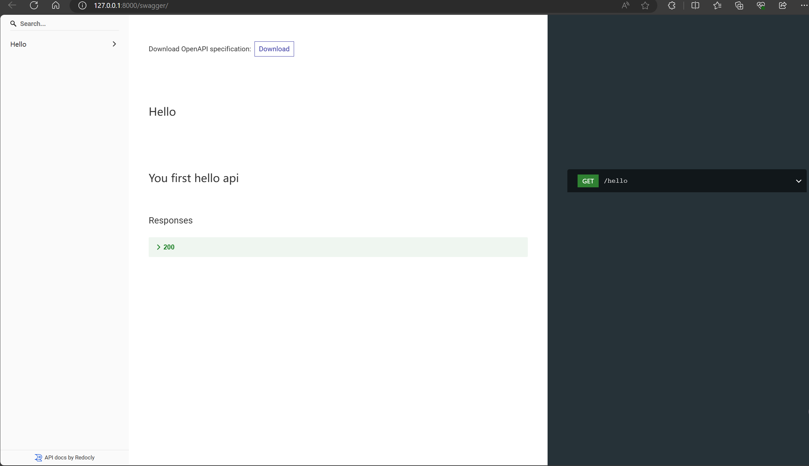
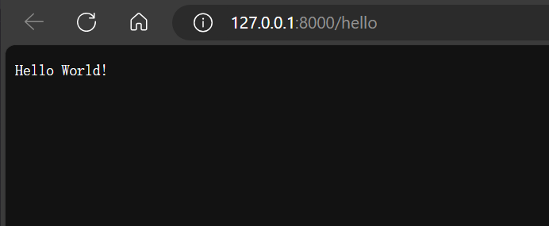
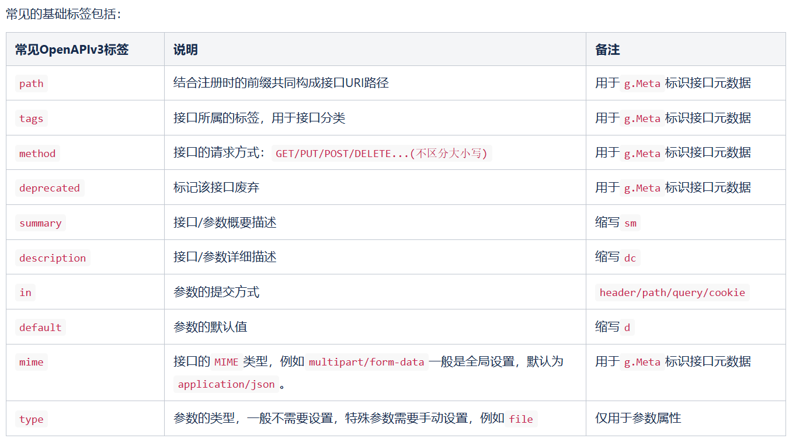
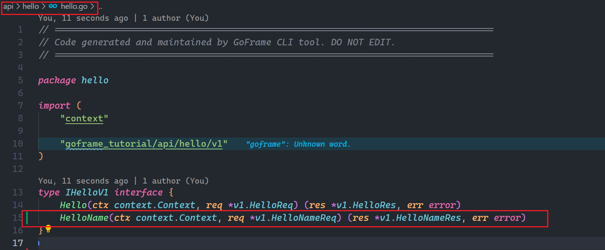
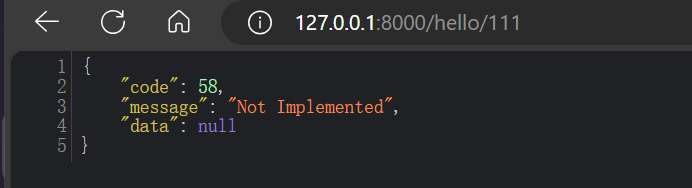
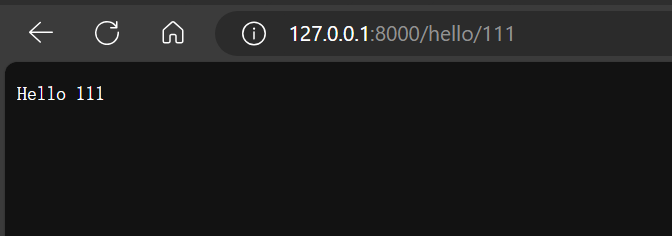
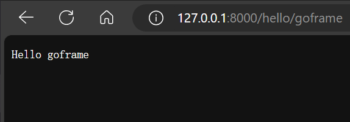

# hello goframe

`mxy` `2024-06-09`

## 1.安装 goframe cli 工具

```sh
go install github.com/gogf/gf/cmd/gf/v2@latest
```

运行完成后命令行输入`gf`提示如下、表示安装成功

```sh
workspace\project
➜ gf
USAGE
    gf COMMAND [OPTION]

COMMAND
    up         upgrade GoFrame version/tool to latest one in current project
    env        show current Golang environment variables
    fix        auto fixing codes after upgrading to new GoFrame version
    run        running go codes with hot-compiled-like feature
    gen        automatically generate go files for dao/do/entity/pb/pbentity
    tpl        template parsing and building commands
    init       create and initialize an empty GoFrame project
    pack       packing any file/directory to a resource file, or a go file
    build      cross-building go project for lots of platforms
    docker     build docker image for current GoFrame project
    install    install gf binary to system (might need root/admin permission)
    version    show version information of current binary

OPTION
    -y, --yes       all yes for all command without prompt ask
    -v, --version   show version information of current binary
    -d, --debug     show internal detailed debugging information
    -h, --help      more information about this command

ADDITIONAL
    Use "gf COMMAND -h" for details about a command.
```

## 2.创建项目

自己找个文件夹打开命令行后输入以下命令来创建项目

```sh
gf init goframe_tutorial -u
```

> `goframe_tutorial`为项目名称，可随意，`-u`为使用最新的模板

显示以下输出为成功

```sh
workspace\code\go
➜ gf init goframe_tutorial -u
initializing...
update goframe...
go: upgraded github.com/BurntSushi/toml v1.2.0 => v1.3.2
go: upgraded github.com/fatih/color v1.15.0 => v1.16.0
go: upgraded github.com/fsnotify/fsnotify v1.6.0 => v1.7.0
go: upgraded github.com/gogf/gf/v2 v2.5.2 => v2.7.1
go: upgraded github.com/gorilla/websocket v1.5.0 => v1.5.1
go: upgraded github.com/grokify/html-strip-tags-go v0.0.1 => v0.1.0
go: upgraded github.com/magiconair/properties v1.8.6 => v1.8.7
go: upgraded github.com/mattn/go-isatty v0.0.19 => v0.0.20
go: upgraded golang.org/x/net v0.12.0 => v0.24.0
go: upgraded golang.org/x/sys v0.10.0 => v0.19.0
go: upgraded golang.org/x/text v0.11.0 => v0.14.0
initialization done!
you can now run "cd goframe_tutorial && gf run main.go" to start your journey, enjoy!
```

然后用 vscode 打开该项目 你也可以使用其他编辑器

> 可以使用快捷命令打开，没安装命令的请手动打开

```sh
code .\goframe_tutorial
```

## 3.运行项目

```sh
gf run .\main.go
```

显示以下代表运行成功

```sh
➜ gf run .\main.go
build: .\main.go
go build -o ./\main.exe  .\main.go
./\main.exe
build running pid: 24772
2024-06-09 22:55:47.213 [INFO] pid[24772]: http server started listening on [:8000]
2024-06-09 22:55:47.213 [INFO] {10fc5852d35dd717d5202b49e1ffe80d} swagger ui is serving at address: http://127.0.0.1:8000/swagger/
2024-06-09 22:55:47.213 [INFO] {10fc5852d35dd717d5202b49e1ffe80d} openapi specification is serving at address: http://127.0.0.1:8000/api.json

  ADDRESS | METHOD |   ROUTE    |                             HANDLER                              |           MIDDLEWARE
----------|--------|------------|------------------------------------------------------------------|----------------------------------
  :8000   | ALL    | /api.json  | github.com/gogf/gf/v2/net/ghttp.(*Server).openapiSpec            |

----------|--------|------------|------------------------------------------------------------------|----------------------------------
  :8000   | GET    | /hello     | goframe_tutorial/internal/controller/hello.(*ControllerV1).Hello | ghttp.MiddlewareHandlerResponse
----------|--------|------------|------------------------------------------------------------------|----------------------------------
  :8000   | ALL    | /swagger/* | github.com/gogf/gf/v2/net/ghttp.(*Server).swaggerUI              | HOOK_BEFORE_SERVE

----------|--------|------------|------------------------------------------------------------------|----------------------------------
```

- 从浏览器打开 swagger 文档 http://127.0.0.1:8000/swagger/ 显示如下

  

- 打开当前的 hello 接口地址 显示如下

  

## 4.编写hello goframe的接口

- 首先在新建`api\hello\v1\hello_name.go` 文件并写入以下内容

  > api文档描述请看[接口文档-OpenAPIv3 - GoFrame (ZH)-Latest - GoFrame官网 - 类似PHP-Laravel, Java-SpringBoot的Go企业级开发框架](https://goframe.org/pages/viewpage.action?pageId=47703679#id-接口文档OpenAPIv3-三、常用协议标签)
  >
  > 

  ```go
  package v1
  
  import (
  	"github.com/gogf/gf/v2/frame/g"
  )
  
  type HelloNameReq struct {
  	// 动态路由
  	g.Meta `path:"/hello/:name" tags:"Hello" method:"get" summary:"You first hello api"`
  	// name 名字 首字母大写为公共字段，小写为私有字段
  	Name string `dc:"名字"`
  }
  
  type HelloNameRes struct {
  	g.Meta `mime:"text/html" example:"string"` // example 为值示例
  }
  ```

  

- 随后运行 以下命令生成接口和controller

  > 详情查看[接口规范-gen ctrl - GoFrame (ZH)-Latest - GoFrame官网 - 类似PHP-Laravel, Java-SpringBoot的Go企业级开发框架](https://goframe.org/pages/viewpage.action?pageId=93880327)

  ```sh
  gf gen ctrl
  ```

  以下提示为成功

  ```sh
  ➜  gf gen ctrl
  generated: D:\workspace\code\go\goframe_tutorial\api\hello\hello.go
  generated: internal\controller\hello\hello_v1_hello_name.go
  done!
  ```

- [api\hello\hello.go](https://github.com/mxyhi/goframe_tutorial/blob/feat/1.hello-goframe/api/hello/hello.go#L15)

  

- [internal\controller\hello\hello_v1_hello_name.go](https://github.com/mxyhi/goframe_tutorial/commit/dc5ac75359111c30cf285607d657d32870545d4f#diff-a804e35c89cf423273d9bf1c5a2d3b125334b351cb352a97657fbd4792b07316)

  ```go
  package hello
  
  import (
  	"context"
  
  	"github.com/gogf/gf/v2/errors/gcode"
  	"github.com/gogf/gf/v2/errors/gerror"
  
  	"goframe_tutorial/api/hello/v1"
  )
  
  func (c *ControllerV1) HelloName(ctx context.Context, req *v1.HelloNameReq) (res *v1.HelloNameRes, err error) {
  	return nil, gerror.NewCode(gcode.CodeNotImplemented)
  }
  ```

- 接下来我们请求[127.0.0.1:8000/hello/111](http://127.0.0.1:8000/hello/111)

  

- 接着把文件内容修改为 [feat: fix hello name api endpoint · mxyhi/goframe_tutorial@ec8074d (github.com)](https://github.com/mxyhi/goframe_tutorial/commit/ec8074d9818471e1ba704531339ec1e2987bef8d#diff-a804e35c89cf423273d9bf1c5a2d3b125334b351cb352a97657fbd4792b07316)

  ```go
  package hello
  
  import (
  	"context"
  
  	"github.com/gogf/gf/v2/frame/g"
  
  	v1 "goframe_tutorial/api/hello/v1"
  )
  
  func (c *ControllerV1) HelloName(ctx context.Context, req *v1.HelloNameReq) (res *v1.HelloNameRes, err error) {
  	g.RequestFromCtx(ctx).Response.Writeln("Hello " + req.Name)
  	return
  }
  
  ```

- 刷新 [127.0.0.1:8000/hello/111](http://127.0.0.1:8000/hello/111)显示如下

  

- 更改网址为[127.0.0.1:8000/hello/goframe](http://127.0.0.1:8000/hello/goframe)显示如下

  

## 结束

- api 设计
- open api 文档
- gf cli
- 